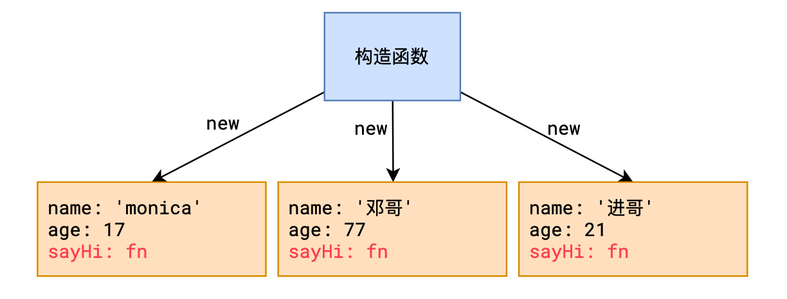
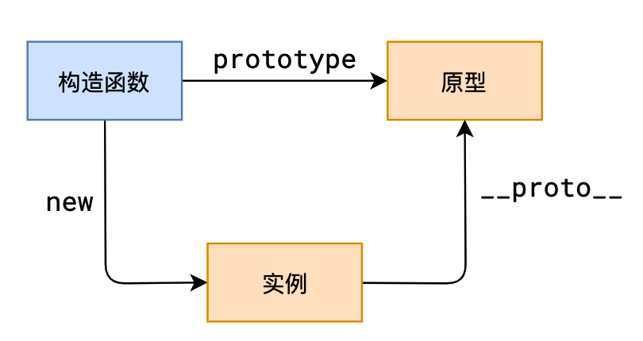
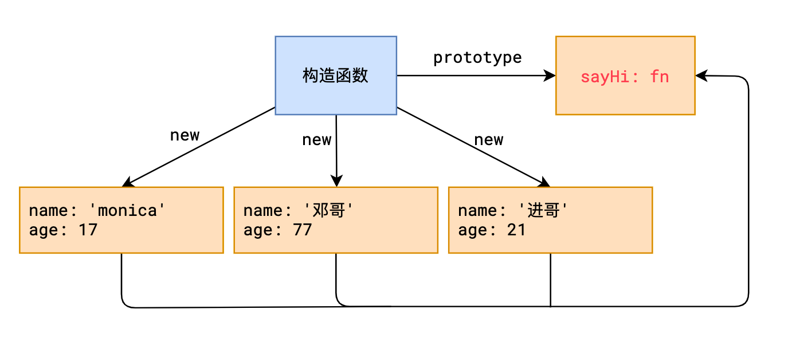

# 原型

##  原型要解决的问题



上图中，通过构造函数可以创建一个用户对象

这种做法有一个严重的缺陷，就是每个用户对象中都拥有一个`sayHi`方法，对于每个用户而言，`sayHi`方法是完全一样的，没必要为每个用户单独生成一个。

要解决这个问题，必须学习原型

## 原型是如何解决的




1. **原型**

   每个函数都会自动附带一个属性`prototype`，这个属性的值是一个普通对象，称之为原型对象

2. **实例**

   instance，通过`new`产生的对象称之为实例。

   > 由于JS中所有对象都是通过`new`产生的，因此，严格来说，JS中所有对象都称之为实例

3. **隐式原型**

   每个实例都拥有一个特殊的属性`__proto__`，称之为隐式原型，它指向构造函数的原型


这一切有何意义？

**当访问实例成员时，先找自身，如果不存在，会自动从隐式原型中寻找**

**这样一来，我们可以把那些公共成员，放到函数的原型中，即可被所有实例共享**




示例代码：

```js
/* 
使用原型重构之前的扑克牌程序
*/
function Poker(number, color) {
  if (number === 14) {
    this.color = 'small';
    this.number = 'joker';
  } else if (number === 15) {
    this.color = 'big';
    this.number = 'JOKER';
  } else {
    var colors = ['♠', '♣', '♡', '🝔'];
    this.color = colors[color - 1];
    var numbers = [
      'A',
      '1',
      '3',
      '4',
      '5',
      '6',
      '7',
      '8',
      '9',
      '10',
      'J',
      'Q',
      'K',
    ];
    this.number = numbers[number - 1];
  }
}

Poker.prototype.print = function () {
  console.log(`${this.color}-${this.number}`);
};

function Deck() {
  this.deck = [];
  for (let i = 1; i <= 13; i++) {
    for (let j = 1; j <= 4; j++) {
      this.deck.push(new Poker(i, j));
    }
  }
  this.deck.push(new Poker(14, 0));
  this.deck.push(new Poker(15, 0));
}

Deck.prototype.print = function () {
  this.deck.forEach((item) => {
    item.print();
  });
};

let deck1 = new Deck();
deck1.print();
```

